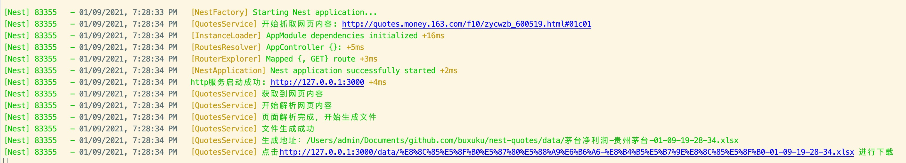
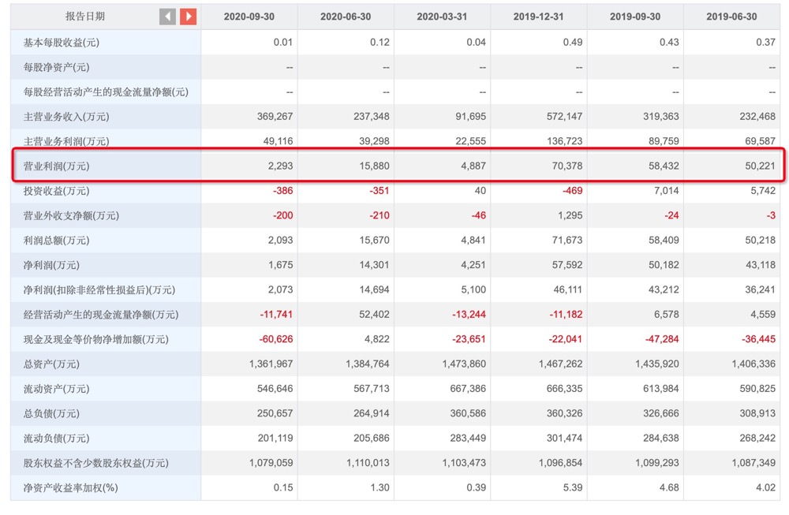

## 个股行情财务分析爬虫

### 简介


可以爬取网易财经个股行情里面指定股票财务分析页面内报告的指定数据(如下图)，并生成excel;




### 特性

* 自定义爬取的页面
* 自定义要爬取的行数据
* 自定义服务启动端口
* 自动获取个股名称用于生成文件名 
* 自定义保存的文件前缀 保存格式为`${filePrefix}-${个股名称}-月-日-时-分-秒`;
* 自定义文件保存目录
* 提供静态资源服务，可以直接下载文件

### 主要技术栈

* nodejs
* nest
* dotenv
* cheerio
* node-xlsx

### 配置说明

```bash
PORT=3000 #服务启动端口
URL=http://quotes.money.163.com/f10/zycwzb_600519.html#01c01 #爬取的网页地址
FILEPREFIX=茅台净利润 #保存文件的前缀
OUTPUT_FOLDER=data #文件保存目录
CAPTURE_TITLE=净利润(扣除非经常性损益后)(万元) #行数据的标题
```

## 安装

```bash
$ npm install
```

## 运行

```bash
# development
$ npm run start

# watch mode
$ npm run start:dev

# production mode
$ npm run start:prod
```

## 测试

```bash
# unit tests
$ npm run test

# e2e tests
$ npm run test:e2e

# test coverage
$ npm run test:cov
```

## License

Nest is [MIT licensed](LICENSE).
